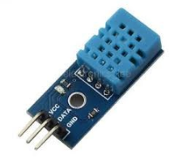
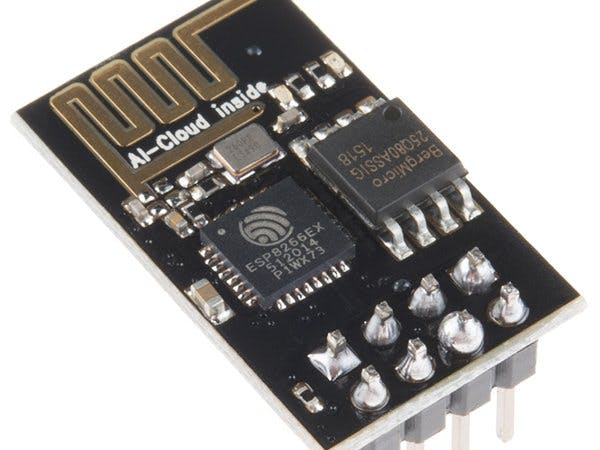
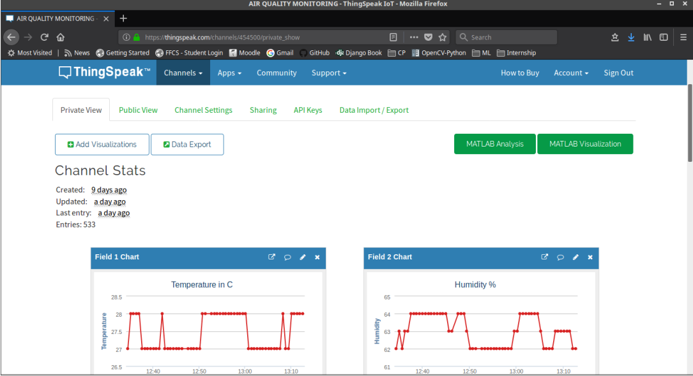
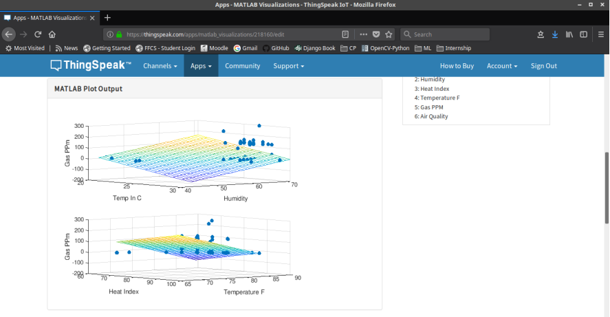
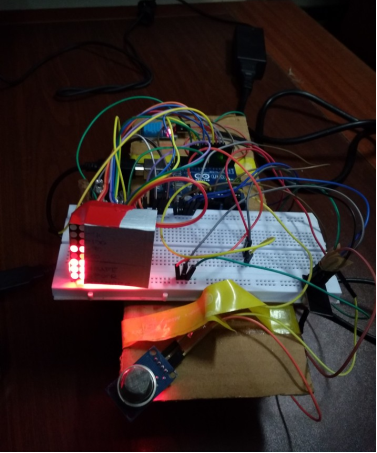

# AQMS

Air Quality Monitoring System (AQMS)  - Implements Arduino based air quality monitoring using MQ135 gas sensor. Data collected is analyzed on Thingspeak cloud platform using linear regression and visualized against temperature and humidity, collected using DHT11 sensor.

### Abstract

Air pollution has become a common phenomenon everywhere. Specially in the urban areas, air
pollution is a real-life problem. A lot of people get sick only due to air pollution. In the urban
areas, the increased number of petrol and diesel vehicles and the presence of industrial areas at the
outskirts of the major cities are the main causes of air pollution. The problem is seriously
intensified in the metropolitan cities. Also, the climate change is now apparent. The governments
all around the world are taking every measure in their capacity. Many European countries have
aimed to replace petrol and diesel vehicles with the electric vehicles by 2030. Even India has
aimed to do so by 2025. The use of coal for electricity generation is now going to be a thing of
past. The nations are now focusing to generate energy from nuclear reactors and the renewable
resources like solar energy, wind energy and hydroelectric power.

In this project we are going to make an IOT Based Air Pollution Monitoring System in which
we will monitor the Air Quality over a web-server using Internet and will trigger a class variable in
web-server when the air quality goes down beyond a certain level, means when there are sufficient
amount of harmful gases are present in the air like CO2, smoke, alcohol, benzene and NH3. It will
show the air quality in PPM on web-page so that we can monitor it very easily. MQ135 sensor,
which is the best choice for monitoring Air Quality as it can detects most harmful gases and can
measure their amount accurately. In this IOT project, we can monitor the pollution level from
anywhere using your computer or mobile. We can install this system anywhere and can also trigger
some device when pollution goes beyond some level, like we can switch on the Exhaust fan or can
send alert SMS/mail to the user.

### Objective

Our objective is to get the required data from sensors and to project that on thingspeak cloud to
analyze it using a machine learning model. Further a SMS is send to the concerned person if gas
ppm goes above a particular level.

### Required Components

* Arduino UNO
* MQ135 Gas Sensor

* DHT11 Sensor

* ESP8266 WiFi Module

* Bread Board
* Jumper Wires

### Working Summary

We start with connecting the ESP8266 with the Arduino. ESP8266 runs on 3.3V and if you will
give it 5V from the Arduino then it won’t work properly and it may get damage. Connect the VCC
and the CH_PD to the 3.3V pin of Arduino. The RX pin of ESP8266 works on 3.3V and it will not
communicate with the Arduino when we will connect it directly to the Arduino. So, we will have
to make a voltage divider for it which will convert the 5V into 3.3V. This can be done by
connecting three resistors in series like we did in the circuit. Connect the TX pin of the ESP8266 to
the pin 10 of the Arduino and the RX pin of the esp8266 to the pin 9 of Arduino through the
resistors. Then we will connect the MQ135 sensor with the Arduino. Connect the VCC and the
ground pin of the sensor to the 5V and ground of the Arduino and the Analog pin of sensor to the
A0 of the Arduino. The MQ135 sensor can sense NH3, NOx, alcohol, Benzene, smoke, CO2 and
some other gases, so it is perfect gas sensor for our Air Quality Monitoring Project. When we will
connect it to Arduino then it will sense the gases, and we will get the Pollution level in PPM (parts
per million). MQ135 gas sensor gives the output in form of voltage levels and we need to convert
it into PPM. So for converting the output in PPM, here we have used a library for MQ135 sensor.
When it exceeds the limit of 1000 PPM, then it starts cause Headaches, sleepiness and stagnant,
stale, stuffy air and if exceeds beyond 2000 PPM then it can cause increased heart rate and many
other diseases. When the value will be less than 1000 PPM, then the SMS and web-page will
display “Fresh Air”. Whenever the value will increase 1000 PPM, then the LED will start blinking
and the web-page will display “Poor Air, Open Windows”. If it will increase 2000 then the LED
will keep blinking and web-page will display “Danger! Move to fresh Air”.

### Methodology

The device developed in this project can be installed near any Wi-Fi hotspot in a populated urban
area. As the device is powered, the Arduino board loads the required libraries, flashes some initial
messages on the LCD screen and start sensing data from the MQ-135 sensor. The sensitivity curve
of the sensor for different combustible gases is already mentioned above. The sensor can be
calibrated so that its analog output voltage is proportional to the concentration of polluting gases in
PPM. The analog voltage sensed at the pin A0 of the Arduino is converted to a digital value by
using the in-built ADC channel of the Arduino. The Arduino board has 10-bit ADC channels, so
the digitized value ranges from 0 to 1023. The digitized value can be assumed proportional to the
concentration of gases in PPM. The read value is first displayed on LCD screen and passed to the
ESP8266 module wrapped in proper string through virtual serial function. The Wi-Fi module is
configured to connect with the ThingSpeak IOT platform. ThingSpeak is an IOT analytics platform
service that allows to aggregate, visualize and analyze live data streams in the cloud. ThingSpeak provides instant visualizations of data posted by the IOT devices to ThingSpeak server. With the
ability to execute MATLAB code in ThingSpeak one can perform online analysis and processing
of the data as it comes in. The Wi-Fi module can be connected with the ThingSpeak server by sending AT commands from
the module. The module first test the AT startup by sending the following command - **AT**

The command is passed by the controller to the Wi-Fi module using software serial function. In
response to the command 'AT', the platform must respond with 'OK' if the cloud service is running.
Then, the AT command to view the version information is passed as follow - **AT + GMR**

In response to this command, the IOT platform must respond by sending back the version
information, sdk version and the time bin is compiled. Next, the AT command to set the connection
to Wi-Fi mode is sent as follow - **AT + CWMODE = 1**

By setting the parameter in CWMODE to 3, the Wi-Fi connection is configured to SoftAP as well
as station mode. This AT command can in fact take three parameters as follow -

1. set Wi-Fi connection to station mode
2. set Wi-Fi connection to SoftAP mode
3. set Wi-Fi connection to SoftAP + station mode

In response to this command, the IOT platform must send back the string indication the Wi-Fi
connection mode set. Now the AT command to reset the module is sent as follow - **AT + RST**

In response to this command, the Wi-Fi module must restart and send back a response of 'OK'.
After resetting the module, AT command to setup multiple connections is enabled by sending the
following command - **AT + CIPMUX=1**

This AT command can take two parameters - 0 for setting single connection and 1 for setting
multiple connections. Next, the command to connect with the Access Point (AP) is passed which takes two parameters where first parameter is the SSID of the registered cloud service on
ThingSpeak and the other parameter is the password to login the cloud service.

**AT+CWJAP=\"SSID\",\"PASS\”**

Now, the AT command to get local IP address is passed as follow - **AT + CIFSR**

In response to this command, the local IP address of the Wi-Fi connection is sent back by the
module. Now, the module is ready to establish TCP IP connection with the ThingSpeak server. The
controller reads the sensor data and store it in a string variable. The TCP IP connection is
established by sending the following AT command - **AT + CIPSTART = 4, "TCP", "184.106.153.149", 80**

The AT + CIPSTART command can be used to establish a TCP connection, register an UDP port or
establish an SSL connection. In the above command, it is used to establish a TCP IP connection.
For establishing a TCP-IP connection, the command takes four parameters where first parameter is
link ID which can be a number between 0 to 4, second parameter is connection type which can be
TCP or UDP, third parameter is remote IP address or IP address of the cloud service to connect
with and last parameter is detection time interval for checking if the connection is live. If the last
parameter is set to 0, the TCP keep-alive feature is disabled otherwise a time interval in seconds
range from 1 to 7200 can be passed as parameter. In response to this command, the server must
respond with 'OK' if connection is successfully established otherwise it should respond with
message 'ERROR'.

Now when the connection with the server is successfully established and the controller has read
the sensor value, it can send the data to the cloud using the following command - **AT + CIPSEND = 4**

This command takes four parameters, where first parameter is the link ID which can be a number
between 0 to 4, second parameter is data length which can be maximum 2048 bytes long, third
parameter is remote IP in case of an UDP connection and remote port number in case of UDP
connection. The third and fourth parameter are optional and used only in case of UDP connection
with the server. Since, the TCP IP connection is established, these parameters are not used. The
command is followed by a string containing the URL having the field names and values passed
through the HTTP GET method. In this project, a string containing the URL having API Key and
the sensor value as the field and value is passed. The passed field and its value are logged on the
cloud server. It is important to pass the API key in this URL as one of the field-value in order to
connect with the registered cloud service. The Air quality measured by sensor can now be monitored and recorded through the thingspeak IOT plat form through the Wi-Fi module. The
recorded data is shown at the ThingSpeak platform as follow -

The user needs to login the ThingSpeak platform from the registered account to view and monitor
the sensor data. The Arduino sketch manages to read sensor data and send the AT commands for
connecting with the IOT platform.

### Conclusion

The Automatic Air quality management system is a step forward to contribute a solution to the
biggest threat. The air monitoring system overcomes the problem of the highly-polluted areas
which is a major issue. It supports the new technology and effectively supports the healthy life
concept. This system has features for the people to monitor the amount of pollution on their mobile
phones using the application. The system to monitor the air of environment using Arduino
microcontroller, IOT Technology is proposed to improve quality of air. With the use of IOT
technology enhances the process of monitoring various aspects of environment such as air quality
monitoring issue proposed in this paper.

